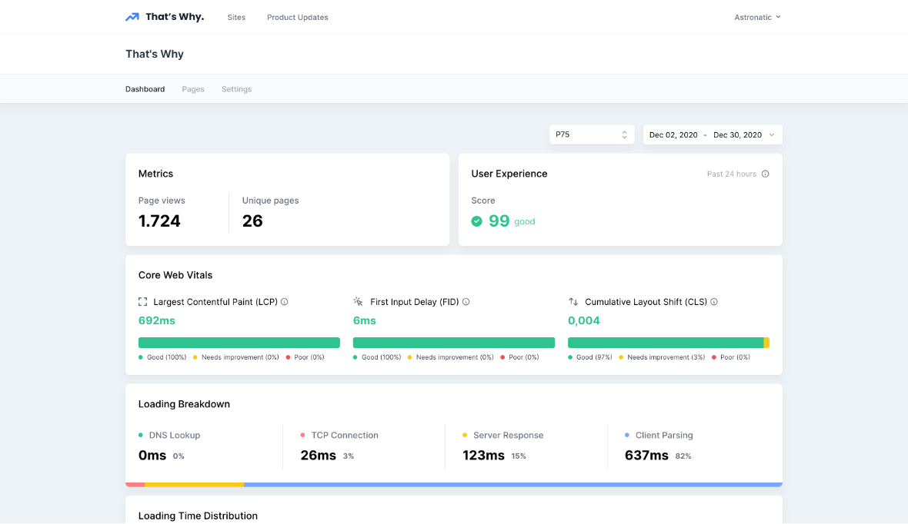

# That's Why for WordPress

[That's Why](https://thatwhy.app/?ref=wordpress-readme) for WordPress is a simple way to add Real User Monitoring inside your Wordpress site without modifying any code.

### What is That's Why Real User Monitoring?
[That's Why](https://thatwhy.app/?ref=wordpress-readme) is the best Real User Monitoring tool out there. We collect, analyze and display real user metrics and give you targeted advice that helps improve the user experience of your website.

To use use this plugin, you need to have your site added to your [That's Why Account](https://thatwhy.app/?ref=wordpress-readme).

### FAQ

**Where can I find the plugin settings?**
This plugin has just a single settings field, which can be found by going to WP Admin > Settings > That's Why.

**Where do I find my Site Hash?**
Your Site Hash is the unique code in your tracking snippet. Go to your Dashboard, select the Site, then Settings. The Site Hash is there visible, copy and paste it from there into the field on the settings page in WordPress.

### Usage

Log into Wordpress

1. [Download the That's Why plugin](https://wordpress.org/support/plugin/thats-why)
2. Go to `Plugins`, `Add New`
3. Upload this plugin, `thats-why.zip`
4. Click `Install Now`, then `Activate`
5. Go to `Settings`, then `That's Why`
6. Type in your `Site Hash`. If you don’t know your `Site Hash`, log into [That's Why Dashboard](https://thatswhy.app/dashboard), go to `Sites`, `Settings`, then your `Site Hash` will be visible on the settings page

Taking the above steps automatically places the That's Why tracking code into the footer of every page of your WordPress site. This snippet is specially made for Wordpress websites and will be updated to support the latest Wordpress features.

Enjoy That's Why Real User Monitoring for WordPress!

### License

GPL-3.0
